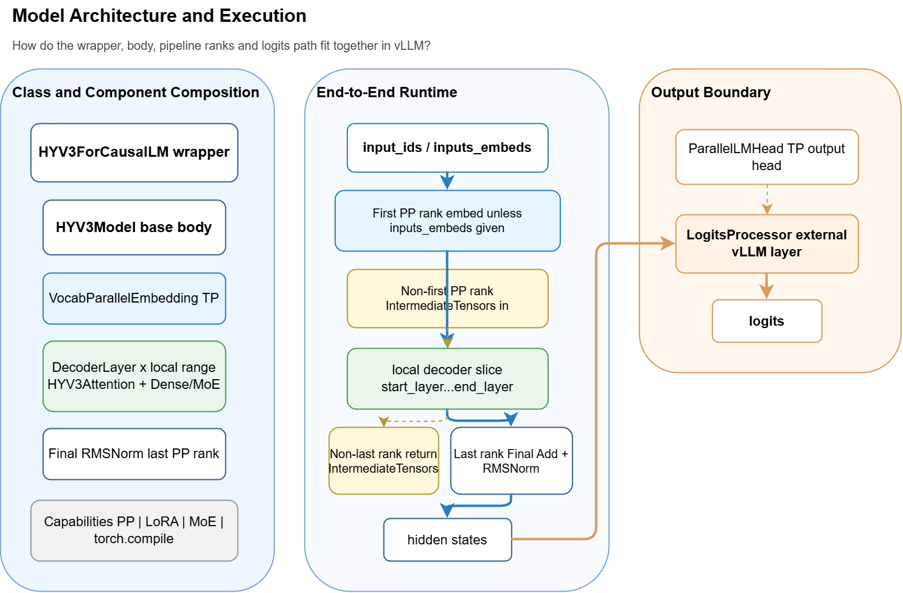
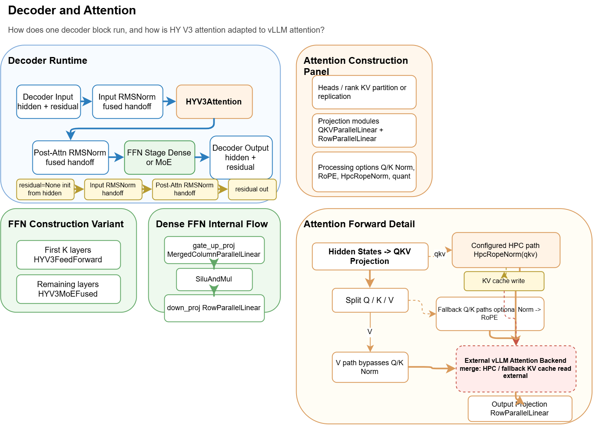
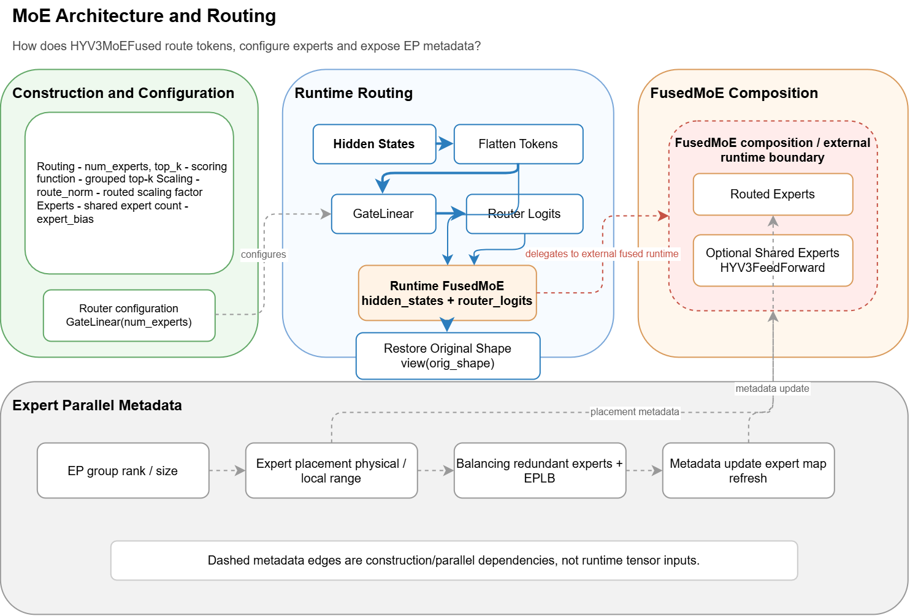
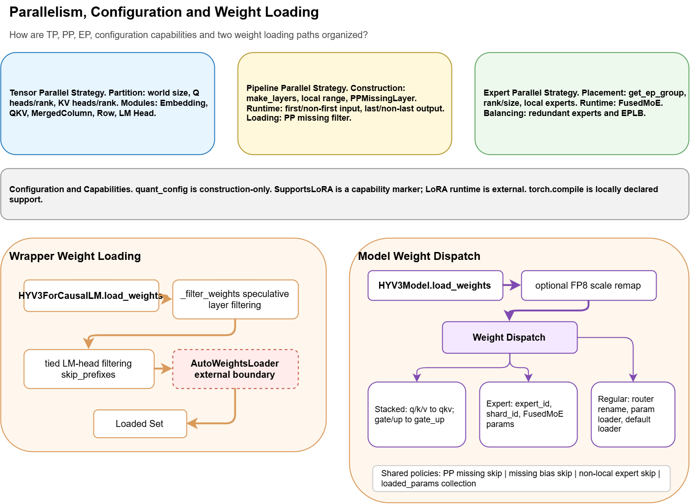

# vLLM Architecture Agent

一个面向 VS Code Codex 的轻量 Agent Skill。它读取 vLLM 模型适配器源码，通过 Draw.io MCP 生成有源码证据、可编辑、少页高密度的架构图。

Codex 负责理解源码和设计图，脚本负责完整索引、证据校验和结果验证。项目不依赖某个模型的固定模板，目标输入是 `vllm/model_executor/models/*.py` 下的模型文件或 Registry architecture 名称。

## 快速开始

准备好 Python 3.10+、Node.js/npm 和 VS Code Codex，然后在仓库根目录执行：

```powershell
.\tools\setup.ps1 -ConfigureDrawioMcp
```

安装完成后重启 VS Code Codex，并输入：

```text
使用 $vllm-model-architecture-diagram 分析 samples/hy_v3.py，生成默认架构图。
```

结果会写入：

```text
outputs/hy-v3/
├── source-context.json
├── architecture-plan.json
├── evidence.json
├── architecture.drawio
├── report.md
├── visual-review.md
└── images/
```

其中 `architecture.drawio` 可以继续编辑，`images/` 适合直接查看，`report.md` 是架构说明和验证结果。

## 它会自动完成什么

一次默认运行会：

1. 完整索引目标文件中的 Class、Method、Branch、Weight Mapping 和 Capability。
2. 由 Codex 阅读源码并决定 3～5 张复合架构图的页面与布局。
3. 为主要架构结论记录 `direct`、`derived` 或 `external` Evidence。
4. 使用 Draw.io MCP 绘图并导出 PNG。
5. 至少进行一轮视觉复查。
6. 验证 Plan、Evidence、Draw.io 和导出文件，再生成报告。

脚本不会替 Codex决定最终架构语义，也不会把外部组件内部行为伪装成本地源码事实。

## 分析其他模型

直接指定模型文件：

```text
使用 $vllm-model-architecture-diagram 分析 vllm/model_executor/models/qwen2.py，生成默认架构图。
```

也可以指定 Registry architecture：

```text
使用 $vllm-model-architecture-diagram 分析 Qwen2ForCausalLM，生成默认架构图。
```

不同类型的模型会得到不同页面。没有 MoE 证据时不会生成 MoE 页面；helper/shared utility 文件会降级为少量边界或说明图。

## 查看示例

可移植的 HY V3 示例位于 [`examples/hy_v3/`](examples/hy_v3/)：

| Model Architecture and Execution | Decoder and Attention |
| --- | --- |
| [](examples/hy_v3/images/model-architecture-and-execution.png) | [](examples/hy_v3/images/decoder-and-attention.png) |
| **MoE Architecture and Routing** | **Parallelism, Configuration and Weight Loading** |
| [](examples/hy_v3/images/moe-architecture-and-routing.png) | [](examples/hy_v3/images/parallelism-configuration-and-weight-loading.png) |

- `architecture.drawio`：四页可编辑架构图
- `images/*.png`：导出的页面图片
- `architecture-plan.json`：页面和源码审阅计划
- `evidence.json`：架构结论对应的源码证据
- `report.md`：完整分析报告
- `visual-review.md`：视觉复查与修改记录

## 手动验证

运行全部测试：

```powershell
pytest
```

验证仓库内示例：

```powershell
vllm-arch validate `
  --repo-root . `
  --context examples\hy_v3\source-context.json `
  --plan examples\hy_v3\architecture-plan.json `
  --evidence examples\hy_v3\evidence.json `
  --drawio examples\hy_v3\architecture.drawio `
  --images-dir examples\hy_v3\images
```

CLI 只保留四个辅助命令：

```text
vllm-arch list-models
vllm-arch prepare
vllm-arch validate
vllm-arch scan
```

日常使用 Skill 时不需要手工填写 repo root、输出目录、Plan 或 Evidence。

## 常见问题

**Codex 找不到 Skill**

重新运行安装脚本，然后重启 VS Code Codex。确认 `.agents/skills/vllm-model-architecture-diagram` 指向 `src/skills/vllm-model-architecture-diagram`。

**Draw.io MCP 不可用**

运行 `codex mcp list`。如果没有 `drawio`，重新执行：

```powershell
.\tools\setup.ps1 -ConfigureDrawioMcp
```

然后重启 VS Code Codex。

**没有真实 vLLM checkout**

先使用 `samples/hy_v3.py` 体验完整流程。需要验证某个 vLLM 版本的全目录兼容性时，准备本地 checkout 后执行：

```powershell
vllm-arch scan --repo-root <vllm-root> --output outputs\compatibility-report.json
```

更多设计和限制说明见 [`docs/mentor/`](docs/mentor/)；旧 compiler-style 研究流水线保存在 `legacy/compiler-pipeline-v1/`，不参与默认运行。
